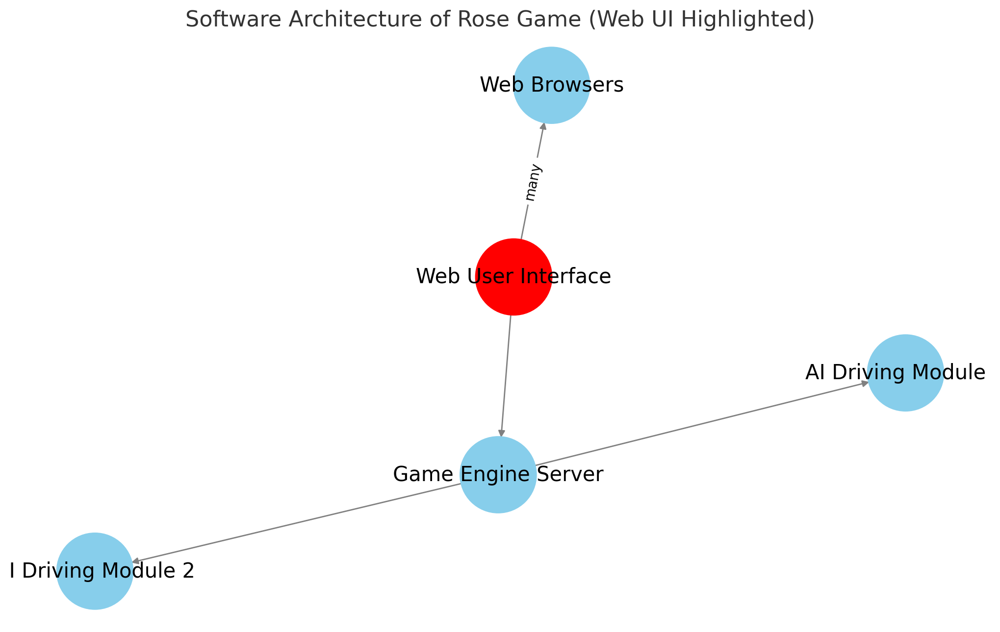

# rose-game-web-ui
[ROSE game](https://github.com/RedHat-Israel/ROSE) web based graphical user interface.

This component implement a web based graphical user interface for the ROSE game.

<p align="center">
  
</p>

ROSE project: https://github.com/RedHat-Israel/ROSE

## Requirements

 Requires | Version | |
----------|---------| ---- |
 Podman (or Docker) | >= 4.8 | For running containerized |
 Node   | >= 20  | For running the code loally |

## ROSE game components

Component | Reference |
----------|-----------|
Game engine | https://github.com/RedHat-Israel/rose-game-engine |
Game web based user interface | https://github.com/RedHat-Israel/rose-game-web-ui |
Self driving car module | https://github.com/RedHat-Israel/rose-game-ai |
Self driving car module example | https://github.com/RedHat-Israel/rose-game-ai-reference |

## Running the web based graphical user interface locally

Clone this repository, and make sure you have a game engine running.

Run the user interface:

```bash
# Install requirments
npm install

# Get help
npm start -- --help

# Run the server (connect to a game engine running on http://127.0.0.1:8880)
npm start -- -hp http://127.0.0.1:8880 -wp ws://127.0.0.1:8880 -p 8080
```

## Running ROSE game components containerized

### Running the game engine ( on http://127.0.0.1:8880 )

``` bash
podman run --rm --network host -it quay.io/rose/rose-game-engine:latest
```

### Running the game web based user interface ( on http://127.0.0.1:8080 )

``` bash
podman run --rm --network host -it quay.io/rose/rose-game-web-ui:latest
```

### Running community contributed driver ( on http://127.0.0.1:8082 )

You can use community drivers to compare and evaluate your driver during the development process.

``` bash
podman run --rm --network host -it quay.io/yaacov/rose-go-driver:latest --port 8082
```

### Running your self driving module, requires a local `mydriver.py` file with your driving module. ( on http://127.0.0.1:8081 )

``` bash
# NOTE: will mount mydriver.py from local directory into the container file system
podman run --rm --network host -it \
  -v $(pwd)/:/driver:z \
  -e DRIVER=/driver/mydriver.py \\
  -e PORT=8081 \
  quay.io/rose/rose-game-ai:latest
```
